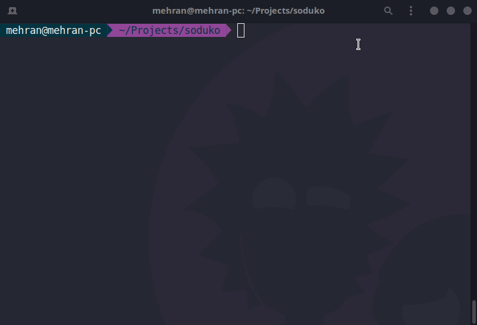

# Solving Sudoko with Backtracking
Sudoku is a logic-based, combinatorial number-placement puzzle.
In classic sudoku, the objective is to fill a 9\*9 grid 
with digits so that each column, each row, and each of 
the nine 3\*3 subgrids that compose the grid contain all 
of the digits from 1 to 9. 
The puzzle setter provides a partially completed grid, which for a well-posed puzzle has a single solution.

## backtraking
One of the good method for solving Sudoku is using Backtracking.
Sudoku can be solved by one by one assigning 
numbers to empty cells. Before assigning a 
number, check whether it is safe to assign. 
Check that the same number is not present in 
the current row, current column and current 3\*3
subgrid. After checking for safety, assign the 
number, and recursively check whether this assignment 
leads to a solution or not. If the assignment 
doesn’t lead to a solution, then try the next 
number for the current empty cell. And if none 
of the number (1 to 9) leads to a solution, 
return false and print no solution exists.

## implementation in C++
The implementation is written in [main.cpp](./main.cpp) file. The program take file name that has the values of game like following:
```
4 0 0 0 0 2 8 3 0
0 8 0 1 0 4 0 0 2
7 0 6 0 8 0 5 0 0
1 0 0 0 0 7 0 5 0
2 7 0 5 0 0 0 1 9
0 3 0 9 4 0 0 0 6
0 0 8 0 9 0 7 0 5
3 0 0 8 0 6 0 9 0
0 4 2 7 0 0 0 0 3
```
if it can find solution, it will print the solution in terminal.
For the previous input you should get this:
```
4,9,1,6,5,2,8,3,7,
5,8,3,1,7,4,9,6,2,
7,2,6,3,8,9,5,4,1,
1,6,9,2,3,7,4,5,8,
2,7,4,5,6,8,3,1,9,
8,3,5,9,4,1,2,7,6,
6,1,8,4,9,3,7,2,5,
3,5,7,8,2,6,1,9,4,
9,4,2,7,1,5,6,8,3,
```

### compile
```
$g++ -std=c++14 main.cpp -o out
```
### running 
```
./out game.txt
```
### Analysis
In this part we calculate complexity of the code
that was written in the previous section. In this 
Analysis we only consider the code related to solving
the sudoku and we ignore the reading from the file 
and storing them in matrix. Suppose our puzzle is N\*N and
it has $K$ elements to fill. First thing that we will
calculate is emptycells, that it takes O(N\*N) cause
we need to visit all the cell to see which one has the value
of zero. The next part is sudoku function that in the 
worst case it will run on the all choices so our runtime is
the recursive form of the following:
```
T(k) = 9T(k-1) + max(O(N),O(k))
```
By a little bit of sloppiness about k the number of
empty cells and by considering that k is a number betwenn 1<= K <= N\*N
the above recurrence give us the time complexity of
O(9^{N\*N}).
For the space complexity we will need O(N*N) to just store
the puzzle and other varibales don't exceed this bound.